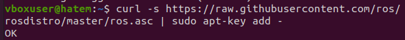
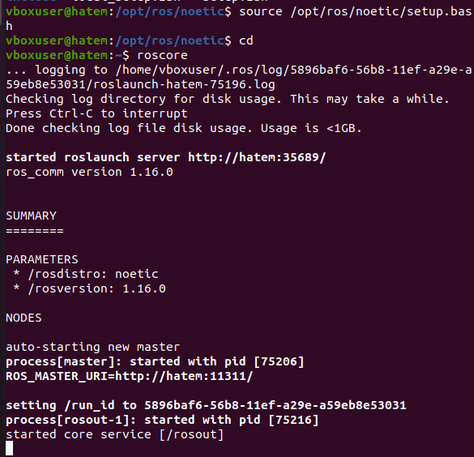

# first task  
* **OverVeiw**
    * this task is how to install ROS Noeic  

* **Installtion Steps**
    * first install ubuntu 20.04 focal version  
    
    * second open terminal then write below command to setup the sources
        ```bash
            sudo sh -c 'echo "deb http://packages.ros.org/ros/ubuntu $(lsb_release -sc) main" > /etc/apt/sources.list.d/ros-latest.list'
        ```  
    
    * third setup the your key
        ```bash
            sudo apt install curl # if you haven't already installed curl
            curl -s https://raw.githubusercontent.com/ros/rosdistro/master/ros.asc | sudo apt-key add -
        ```  
        if downloaded successfully it you will see this output  
        

    * forth update the debian packages and i recommended to download the fully version of ros-noetic
        ```bash
            sudo apt update
            sudo apt install ros-noetic-desktop-full
        ```
        **Be carful it will take long time to install because it depends on your WiFi connection speed**  
        after it installed your working directory and run this command
        ```bash
            cd /opt/ros/noetic
            source /opt/ros/noetic/setup.bash
            roscore
        ```
        this output look like this  
        

    * finally is setup enviroment because if you want use ros will need run this script every time you lunch new terminal
    ```bash
        source /opt/ros/noetic/setup.bash
    ```
    so you need embeded this script in your bash and you can run roscore command from any new terminal you opened  
