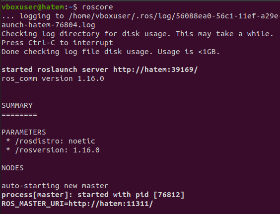
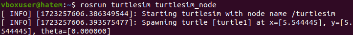
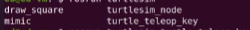
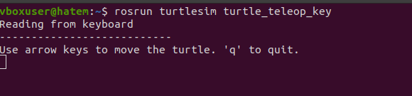
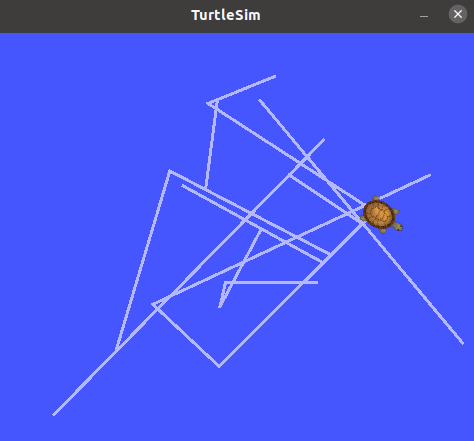

# second task  

* **OverVeiw**
    * this task about how to use turtlesim and minpulate it 

* **Installtion Steps**  

    * you have run this command to install turtlesim

        ```bash
            sudo apt-get install ros-$(rosversion -d)-turtlesim
        ```

* **How to use turtulesim**  

    * first you need to open at least 3 terminals  
        * first terminal you will run **roscore** command  
          

        * second terminal you run **rosrun turtlesim turtlesim_node** to open  
          

        * third terminal you run **rosrun turtlesim how-you-want-to-Manipulate-it** you can choose from 4 different approaches  
          
        
        here im using rosrun turtlesim turtle_teleop_key  
          

* **Output**  
    
